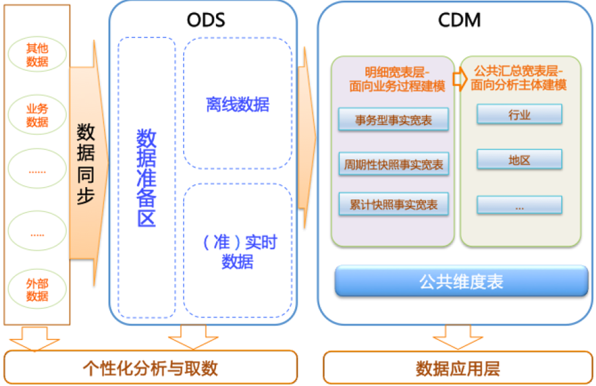

## 数仓中常用表，及其作用

### 全量表、快照表、增量表、拉链表、维度表、实体表、事实表是数据仓库中常见的表格类型。

1. **全量表**是数据仓库中数据最全面、完整的表，包含所有**历史数据和当前数据**。全量表的数据量通常很大，因此查询全量表可能需要较长时间。

2. **快照表**是特定时间点的全量表，它只包含特定**时间点的数据，而没有历史数据**。快照表通常用于查询特定时间点的数据，因为它的数据量比全量表小，查询速度更快。

3. **增量表**是只包含增量数据的表，它不包含历史数据。**增量表通常用于更新全量表或快照表**，以避免重复加载数据。

4. **拉链表**是一种特殊的增量表，它包含**历史数据和当前数据之间的差异**。拉链表通常用于时间序列数据的存储和处理。

5. **维度表**是数据仓库中的一种特殊类型的表，它包含用于查询和分析数据的**维度信息，例如时间、地区、产品、订单状态，支付方式，审批状态，商品分类等**。维度表通常包含过滤条件和分组条件，以支持多种查询和分析场景。

6. **实体表**是一种特殊的维度表，它包含**特定实体的所有历史数据和当前数据**。实体表通常用于存储和管理特定实体的数据，例如客户、产品等。

7. **事实表**是数据仓库中的另一种特殊类型的表，它包含用于**计算和分析事实的数据**。事实表通常包含**度量值和关联维度**，可以用于计算多种指标和度量，例如销售额、成本等。

在数据仓库中，不同的表格类型具有不同的用途和特点，它们可以组合使用，以支持多种查询和分析场景。了解这些表格类型的特点和用途是构建有效数据仓库的重要前提。

## 补充：
**实体表** ：指现实存在的对象，比如用户，商品，商家，销售员；如果你是老板，你会如何登记一条顾客的数据，这个顾客的信息数据就是实体表里面的一条数据

*维度表*：

**事实表** ：事实表
事实表中的每行数据代表一个业务事件（比如说你在淘宝上下单、支付、退款、评价等各种行为都算作一个事件）。那么“事实”这个术语表示的是业务事件的度量值（我们可以统计次数、个数、金额等），例如，今年的双十一，你在哪家店铺买了多少钱买了多少商品，那么这个对应我们可以将这一个动作记录在维度表中的：时间，用户，商品，店铺，登记在事实表里面的度量值可以有购买金额和购买数量。

每一个事实表的行包括：具有可加性的数值型的度量值【因为最能体现出效果的就是数字啦】、与维度表相连接的外键【我的理解就是不然光秃秃你也不知道咋讲啥】、通常具有两个和两个以上的外键、外键之间表示维表之间多对多的关系。

那么事实表的特征：首先 数据量非常的大(行数)，因为就光双十一这一天产生多少订单，然后我们的一切行为数据就会被这么记录了，那么可以想象那行能不多嘛， 内容相对的窄：列数较少（主要是外键id和度量值），这个是因为事实表的设计初衷就是这样，想要窄窄的记录重要的信息，不负责属性的各种描述，并且它还会经常发生变化，每天会新增加很多，还是拿电商举例就是说，每天的订单记录会不停在增加。

在此基础上于是就产生了三大事实表！

1）事务型事实表

事务事实表的粒度是每一行数据对应一个事务，或者一行对应事务中的一个条目。事务可以理解为业务过程中的各个事件节点，比如网购交易过程中的创建订单=>买家付款=>物流过程中的揽活，发货，签收=>退款过程中的申请退款，确认退款等，都可以理解为事务。事务事实表针对这些过程构建，作为数仓的原子明细数据，**可以跟踪定义业务过程的事件，提供丰富的分析能力**。事务事实表只有事务发生才会新增对应的一条数据，一般不会做更新操作。

简单来说，事实表就是以每个事务或事件为单位，比如说一个销售订单记录，一笔支付记录等，我们都可以作为事实表里的一行数据。一旦事务被提交，事实表数据被插入，数据就不再进行更改，其更新方式为每日增量更新。

2）周期型快照事实表

周期快照事实表在了解有规律的、可预见时间间隔的业务累计性能方面很有必要。与针对每个出现的事件都要加载一行数据的事务事实表不同，利用周期快照可以在每天，每周，每月结束时，为当时的行为进行拍照，然后在下一周期拍另一张照片，比如商品库存，账户余额，每日交易额，每月累计交易额等。事务事实表需要聚集长期的事务历史才能得出这些结果，使用效率比较差，可以用周期快照作为事务事实表的补充。

周期型快照事实表中不会保留所有数据，只保留固定时间间隔的数据，例如每天或者每月的销售额，或每月的账户余额等。还有就是例如购物车，有加减商品，随时都有可能变化，但是我们更关心每天结束时这里面有多少商品，方便我们后期统计分析。因此周期型快照事实表的更新方式为每日全量更新，即每日对数据做一个快照。

3）累积型快照事实表

累积快照表完全涵盖一个事务或者离散产品（或者用户）的生命期的不确定跨度。累积快照表具有多个日期字段，用于对应可预见的主要事件或者环节的发生时间。通常还有一个用于指示快照行最后一次更新的附加日期列。

累积快照事实表需要对数据进行重新访问，当某一事件发生后，需要对应时间字段和相关度量进行更新操作，而不是新增一行。累积快照可以很好的满足某些特殊的需求，例如:统计下单到支付的时长，支付到发货的时长，下单到确认收货的时长等。如果用事务事实表的话逻辑复杂且性能较差。

**换句话说累积快照事实表用于跟踪业务事实的变化。**例如，数据仓库中可能需要累积或者存储订单从下订单开始，到订单商品被打包、运输、和签收的各个业务阶段的时间点数据来跟踪订单生命周期的进展情况。当这个业务过程进行时，事实表的记录也要不断更新。

## 数仓分层
自下而上为：数据引入层（ODS）、数据公共层（CDM）和数据应用层（ADS）。
数仓分层及各层用途如图：

1. 数据引入层ODS：存放未经过处理的原始数据至数据仓库系统，结构上与源系统保持一致，是数据仓库的数据准备区。主要完成基础数据引入到MaxCompute的职责，同时记录基础数据的历史变化。

2. 数据公共层CDM，包括DIM维度表、DWD和DWS，由ODS层数据加工而成。主要完成数据加工与整合，建立一致性的维度，构建可复用的面向分析和统计的明细事实表，以及汇总公共粒度的指标。

    2.1. 公共维度层（DIM）：基于**维度建模理念思想**，建立整个企业的**一致性维度**。降低数据计算**口径和算法**不统一风险。  
    公共维度层的表通常也被称为逻辑维度表，维度和维度逻辑表通常一一对应。  

    2.2. 公共汇总粒度事实层（DWS）：以**分析的主题对象作为建模驱动**，基于上层的应用和产品的指标需求，构建公共粒度的汇总指标事实表，以宽表化手段物理化模型。构建命名规范、口径一致的统计指标，为上层提供公共指标，建立汇总宽表、明细事实表。
    公共汇总粒度事实层的表通常也被称为汇总逻辑表，用于存放派生指标数据。  

    2.3. 明细粒度事实层（DWD）：以**业务过程作为建模驱动**，基于每个具体的业务过程特点，构建最细粒度的明细层事实表。可以结合企业的数据使用特点，将明细事实表的某些重要维度属性字段做适当冗余，即宽表化处理。
    明细粒度事实层的表通常也被称为**逻辑事实表**。

3. 数据应用层ADS：存放数据产品个性化的统计指标数据。根据CDM与ODS层加工生成。

该数据分类架构在ODS层分为三部分：数据准备区、离线数据和准实时数据区。整体数据分类架构如下图所示。

## 数仓分层
https://help.aliyun.com/zh/maxcompute/getting-started/divide-a-data-warehouse-into-layers?spm=a2c4g.11186623.0.preDoc.44a77756HnVR4W

dwd层
https://developer.aliyun.com/article/1532421?spm=a2c6h.12873639.article_relatearticle.d_article_relatearticle_8.43481b74HJt8L3&scm=20140722.ID_community@@article@@1532421._.ID_community@@article@@1532421-OR_rec-V_1-RL_community@@article@@1458075

dws层
https://developer.aliyun.com/article/970986

ads层
https://developer.aliyun.com/article/1532449?spm=a2c6h.12873639.article-detail.4.61fe4611KfxnhC
https://developer.aliyun.com/article/1532450?spm=a2c6h.12873639.article-detail.5.427d7c53uTJqL3

阿里云：maxcomputer 云原生大数据计算服务
https://help.aliyun.com/zh/maxcompute/getting-started/data-warehouse-detail-layer

退化维
https://blog.csdn.net/laozaoxiaowanzi/article/details/128545215

实际案例
https://blog.csdn.net/weixin_46389691/article/details/134123988

dws层设计案例 （优雅的设计dws层）
https://developer.aliyun.com/article/970986

